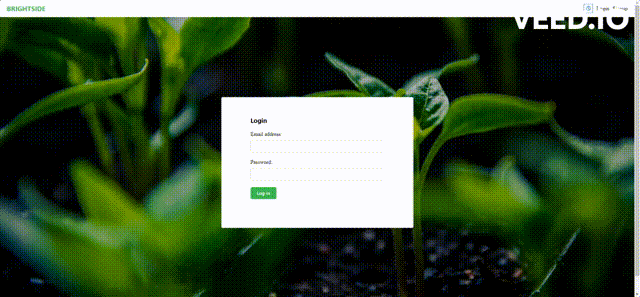

# Brightside

### Talk, trade and grow your passion.
<!-- 

 -->

 

  

## About

This project is a fullstack social media site made by and for gardeners. Users can post images of their garden and trade each others' seeds to use for their own garden.

I never thought I would garden as a hobby, and picked it up on a whim, and I felt a sense of fullfillment and peace of mind while gardening. I hope fellow gardeners can use this application to share the fruits of their labor and make new friends!

## Details
The application has the following pages:
- **Signup page**: The user will provide email and password to create an account.
- **Login page**: Email and password credentials will be provided here to authenticate the user.
- **Viewtool page**: Access an internal webapp to view an exhaustive list of different speices of plants.
- **Profile page**: The user can view their own posts and login email here.
- **Feed page**: The user can search the database from here.
- **About page**: This application includes an about page in which users can understand the purpose of the webapp.

## Technologies Used
Made with **Node.js**, **Express**, **MongoDB**, **React**, **MantineUI**, **Cloudinary**, **JWT**, and **CSS3**.

## Use and Installation
This app is hosted at [here](https://brightside-frontend.vercel.app/) but you may test it locally with the instructions below.

### Install
 `npm install`
 
### Things you'll need to add
To get the values for these environment variables, you will need to
  1) Create an account and set up a cluster for this project on MongoDB
  2) Create an account on Cloudinary
   
- Create a `.env` file, put it in your config folder, and add the following as `key = value`
  - PORT = `your preferred port for local host`
  - SECRET = `your JWT secret key`
  - MONGO_URI = `your database URI`
  - CLOUDINARY_CLOUD_NAME = `your cloudinary cloud name`
  - CLOUDINARY_API_KEY = `your cloudinary api key`
  - CLOUDINARY_API_SECRET = `your cloudinary api secret`

### Packages/Dependencies Utilized
    "bcrypt": "^5.0.1",
    "cloudinary": "^1.25.1",
    "cors": "^2.8.5",
    "connect-mongo": "^3.2.0",
    "dotenv": "^8.2.0",
    "react": "^18.1.0",
    "@mantine/core": "^6.0.13",
    "express": "^4.18.2",
    "express-flash": "^0.0.2",
    "express-session": "^1.17.1",
    "method-override": "^3.0.0",
    "mongodb": "^3.6.5",
    "mongoose": "^5.12.3",
    "morgan": "^1.10.0",
    "multer": "^1.4.5-lts.1",
    "nodemon": "^2.0.7",
    "jsonwebtoken": "^8.5.1",
    "validator": "^13.7.0"

## Things to add

- ~~Migrating to React Views from EJS template engine.~~
- ~~Host the client site.~~
- ~~Integrate a Plant Data API for clientside use.~~

---
